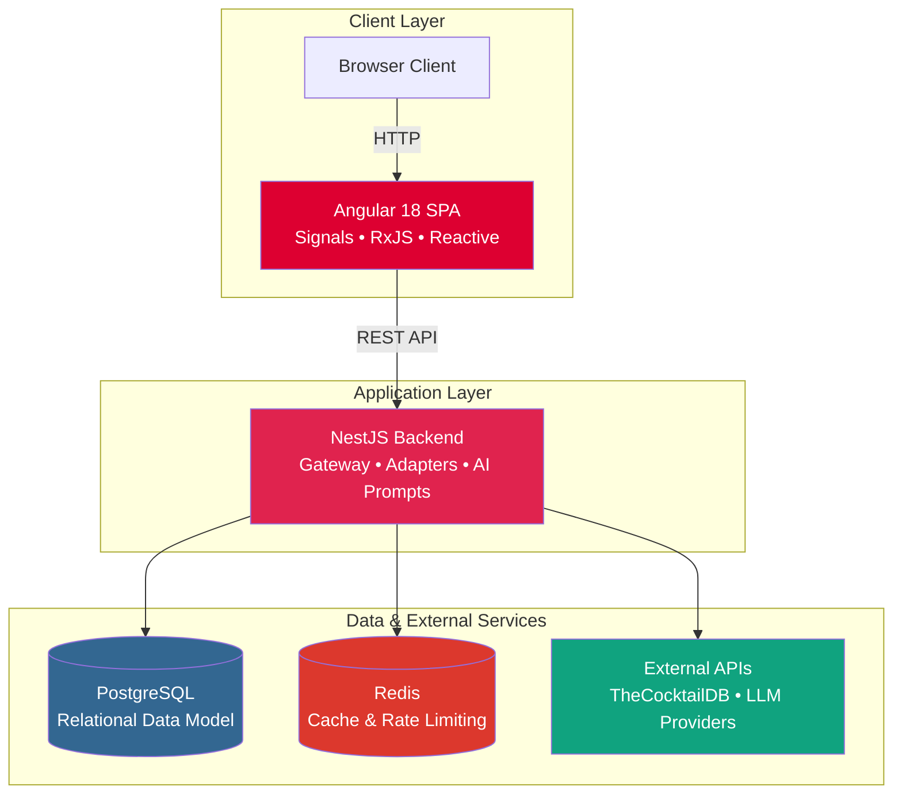

# 🍸 MixologyHub


<p align="center">


</p>
 

## 📖 Project Overview
 

MixologyHub is a modern, enterprise-grade full-stack web application designed for cocktail enthusiasts and professional bartenders. It serves as a unified platform to discover new recipes, manage a personal ingredient inventory, and generate completely unique cocktail recipes using Generative AI.
 

Built as a showcase of **Senior Full-Stack Engineering** practices, this project demonstrates clean architecture, scalable API design, third-party API aggregation, strict data modeling, and containerized deployment.
  
## ✨ Key Features & Technical Highlights
 

- **🧠 Agnostic AI Bartender:** Implements the Dependency Inversion principle to integrate LLMs (Large Language Models). Configured via environment variables, you can plug in **DeepSeek, OpenAI, Anthropic**, or any compatible API to generate strict JSON recipes based on a user's available ingredients.

- **🌍 Unified API Aggregation (Adapter Pattern):** Seamlessly merges local database user-recipes with thousands of public recipes from `TheCocktailDB`. The backend normalizes dirty external JSON into strict internal DTOs on the fly.

- **📦 Smart Inventory & Math Engine:** Tracks user ingredients with strict base-unit conversions (e.g., converting ounces to milliliters mathematically). The system dynamically queries and calculates exactly which cocktails a user can make based on real-time stock.

- **⚡ High Performance Caching:** Integrates **Redis** to cache external API searches (TTL-based), drastically reducing third-party API calls and improving response times.

- **🔐 Modern Reactive UI:** The frontend is built with **Angular 18+**, utilizing Standalone Components, the new Zoneless Change Detection (`provideZonelessChangeDetection`), Angular Signals for state management, and strict RxJS streams.


> **🔐 Note on Authentication (MVP State):** To simplify the local developer experience and code review process, Auth is currently bypassed. A `SeederService` automatically provisions a mock user (`mock@test.com`) on boot to satisfy all Foreign Key database constraints. Full JWT/OAuth2 implementation is slated for the next roadmap phase.

  
## 🏗️ High-Level Architecture

The system is fully containerized and divided into distinct micro-services operating within a Docker network:



## 🚀 Quick Start
 

The entire application infrastructure is orchestrated via Docker Compose. You do not need to install Node.js, PostgreSQL, or Redis on your host machine to run this project.
  

### 1. Clone & Configure

```bash

git clone https://github.com/zantgo/mixology-hub.git

cd mixology-hub

```

  
Copy the example environment file and configure your variables:

```bash
cp .env.example .env
```

Then edit `.env` to add your actual API keys (this file is ignored by git). The `.env.example` file contains all required variables including AI provider configuration for DeepSeek, OpenAI, or Anthropic.

  
### 2. Start the Stack

We provide a `Makefile` wrapper for Docker Compose commands:

```bash

make start

```

  
### 3. Access the Application

- **Frontend App:** [http://localhost:8080](http://localhost:8080)

- **Backend API:** [http://localhost:3000](http://localhost:3000)

- **Swagger API Docs:** [http://localhost:3000/api-docs](http://localhost:3000/api-docs)

  
To stop the application, run `make stop`. To completely reset the database and volumes, run `make clean`.
 

## 📚 Technical Documentation

  
To keep this README concise, detailed engineering documentation has been separated into the `docs/` directory. These documents explain the *why* and *how* behind the technical decisions:
 

* **Architecture & System Design:**
  * [System Overview](./docs/architecture/system-overview.md) – Containerized microservices, provider-agnostic AI integration
  * [Backend Architecture](./docs/architecture/backend-architecture.md) – NestJS patterns, database optimization strategies
  * [Frontend Architecture](./docs/architecture/frontend-architecture.md) – Angular 18+ Signals, zoneless change detection
  * [Observability Strategy](./docs/architecture/observability.md) – Logging, monitoring, and tracing for production
  * [Deployment Strategy & CI/CD](./docs/architecture/deployment-and-cicd.md) – Production deployment patterns and automation
  * [Architecture Decision Records (ADRs)](./docs/architecture/adrs/) – Context on tech stack choices and trade-offs

* **Data & APIs:**
  * [Database Schema & ERD](./docs/database/database-schema.md) – PostgreSQL design with unit conversion considerations
  * [API Documentation & Testing Hub](./docs/api/README.md) – Postman collection, testing guide, and REST API specification

* **Product & Features:**
  * [Product Use Cases (BDD/TDD)](./docs/product/use-cases.md) – Gherkin scenarios driving test-driven development
  * [Features Deep-Dive](./docs/product/features.md) – Use cases and business logic implementation
  * [Future Roadmap](./docs/product/roadmap.md) – Phased development plan and scalability roadmap

* **Development & DevOps:**
  * [Local Setup Guide](./docs/development/setup.md) – Docker-first development environment
  * [Coding Standards](./docs/development/coding-standards.md) – TypeScript best practices, LLM security patterns
  * [Testing Strategy](./docs/development/testing.md) – TDD approach, testing pyramid, Red-Green-Refactor
  * [TypeORM Decimal Transformers](./docs/development/typeorm-decimal-transformers.md) – Handling floating-point precision issues in Node.js

* **Security:**
  * [LLM Prompt Security](./docs/security/llm-prompt-security.md) – Defending against Prompt Injection attacks

  

## 💻 Tech Stack Summary
 
| Layer              | Technologies Used                                        |
| ------------------ | -------------------------------------------------------- |
| **Frontend**       | Angular, TypeScript, RxJS, Angular Signals, SCSS, Vitest |
| **Backend**        | NestJS, Node.js, TypeORM, Swagger (OpenAPI)              |
| **Database**       | PostgreSQL                                               |
| **Cache**          | Redis                                                    |
| **Infrastructure** | Docker, Docker Compose, Nginx                            |
  
## 👨‍💻 Author
  
**Santiago Rojas**

*Software Engineer*

* [LinkedIn](https://www.linkedin.com/in/santiago-tomas-rojas-jimenez)
* [Portfolio](https://www.zantgo.dev)
  
---

*This project is licensed under the MIT License.*