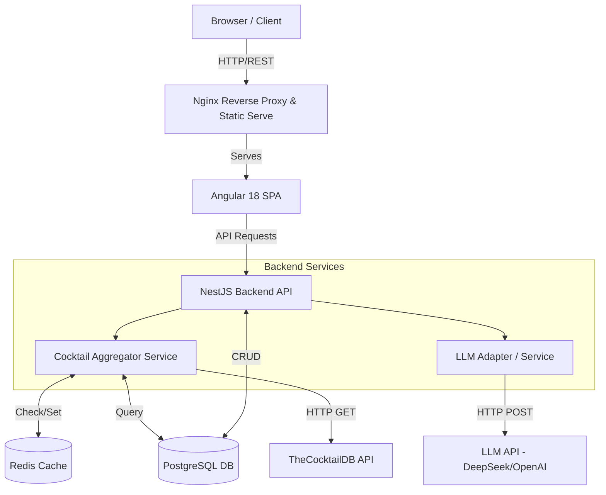

# System Architecture Overview

  

This document provides a high-level overview of the MixologyHub architecture. The system follows an **N-Tier (Multi-tier) Architecture**, containerized via Docker, allowing for clear separation of concerns, independent scaling of layers, and robust data management.

  

## 🏗 High-Level Architecture Diagram

  

The system is composed of five distinct layers: Presentation, Application, Caching, Persistence, and External Integration.

  

  

---

  

## 🧩 Core Components

  

### 1. Presentation Layer (Frontend)

- **Technology:** Angular 18+, Nginx

- **Responsibility:** Handles the user interface, reactive state management (via Angular Signals), and asynchronous data streams (RxJS).

- **Deployment:** The production build is statically served via an Nginx Alpine container, ensuring lightweight and blazing-fast delivery of assets.

  

### 2. Application Layer (Backend API)

- **Technology:** NestJS, Node.js, Express

- **Responsibility:** Acts as the central nervous system of the application. It handles routing, validation (DTOs), business logic, and database transactions.

- **Key Pattern:** It utilizes a **Modular Monolith** approach. Domains (`users`, `cocktails`, `ai`, `inventory`) are isolated into their own modules, making it easy to extract them into microservices in the future if scale demands it.

  

### 3. Caching Layer

- **Technology:** Redis

- **Responsibility:** Reduces latency and prevents rate-limiting from external APIs.

- **Implementation:** When a user searches for a public cocktail, the backend checks Redis first. If a cache miss occurs, it fetches from the external API, stores the result in Redis with a Time-To-Live (TTL) of 5 minutes (300 seconds), and returns the response.

  

### 4. Persistence Layer (Database)

- **Technology:** PostgreSQL, TypeORM

- **Responsibility:** Maintains strict relational data integrity for Users, Local Cocktails, Ingredients, and Inventory.

- **Implementation:** Uses ACID-compliant transactions (e.g., when a user "prepares" a cocktail, reducing their inventory and logging the action must succeed or fail as a single unit).

  

### 5. External Integration Layer

- **TheCocktailDB:** A public REST API providing thousands of community-sourced recipes.

- **LLM AI Provider (e.g., DeepSeek):** Accessed via HTTP requests. The backend builds strict prompt templates requesting structured JSON output.

  

---

  

## 📐 Key Architectural Decisions

  

### 1. Unified Search Aggregator (Adapter Pattern)

Instead of forcing the frontend to make two separate requests (one to our DB, one to the public API), the NestJS backend handles this via the `CocktailAggregatorService`.

- It fetches local recipes from PostgreSQL.

- It fetches public recipes from TheCocktailDB.

- It uses the **Adapter Pattern** to map the dirty, inconsistent JSON from the external API into our strict internal DTO format.

- It returns a single, unified, paginated array to the frontend.

  

### 2. Provider-Agnostic AI Architecture (Dependency Inversion)

The AI module is designed around interfaces, not concrete implementations. By relying on environment variables (`AI_API_URL`, `AI_API_KEY`, `AI_MODEL`), the system is completely decoupled from any specific AI vendor.

- **Why?** If OpenAI goes down, changes their pricing, or if an open-source model like DeepSeek becomes preferable, the system can be swapped over by simply updating the `.env` file—zero code changes required.

  

### 3. Strict Server-Side Math Engine for Inventory

Inventory management and unit conversion (e.g., ounces to milliliters) are handled **strictly on the backend**.

- **Why?** Trusting the client (frontend) to calculate inventory deductions can lead to race conditions or manipulated data. The backend `UnitConverterService` standardizes all incoming measurements to a base unit (e.g., `ml`) before executing mathematical validations against the user's current stock.

### 4. Role-Based Access Control (RBAC) System

The system implements a comprehensive RBAC system with two primary roles: `bartender` and `admin`.

- **Database Schema:** The `users` table includes a `role` column with default value `'bartender'`.
- **Authorization Guards:** NestJS `AdminGuard` protects admin-only endpoints (`POST /bar-inventory`, ingredient management) by verifying JWT payload roles.
- **Admin Privileges:** Bar Manager — manages shared `bar_inventory` (add/update/delete stock), ingredient taxonomy, and system configuration.
- **Bartender Access:** Staff — browse recipes, check makeability, submit "Prepare" orders via the BullMQ queue, view preparation history.
- **Queue-Based Concurrency:** All inventory-deducting operations (cocktail preparation) flow through a single-threaded BullMQ worker (`concurrency: 1`), mathematically eliminating race conditions. See ADR 0017.
- **Audit Logging:** All admin actions are logged for security and compliance purposes.
