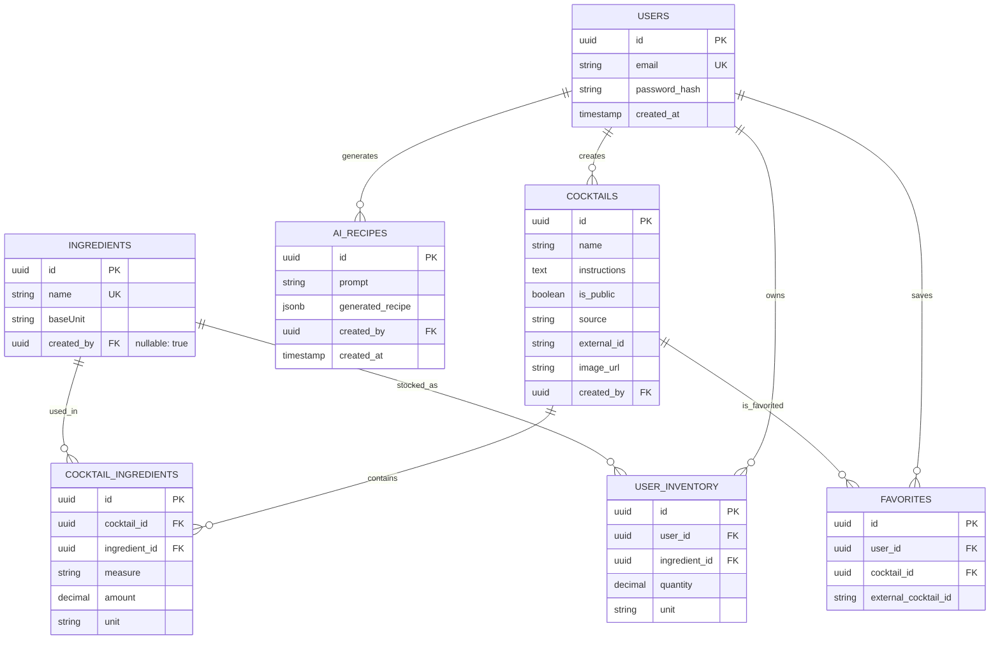

# Database Schema & Data Modeling

  

MixologyHub uses **PostgreSQL** as its primary persistent data store, interfaced via **TypeORM**. The schema is highly relational and strictly typed, ensuring robust data integrity, cascading deletions, and mathematical accuracy for inventory calculations.

  

## 📊 Entity-Relationship Diagram (ERD)

  



  

---

  

## 🗄️ Core Tables & Design Decisions

  

### 1. `users`

Handles authentication and relationship anchoring.

- **Primary Key:** `UUID` (Standardized across all tables for security and distributed generation).

- **Unique Constraint:** `email`.

  

### 2. `ingredients`

The global catalog of all possible ingredients.

- **`name`:** Stored in lowercase to prevent case-sensitive duplication (e.g., "Vodka" vs "vodka").

- **`baseUnit`:** A critical field (e.g., `ml`, `g`). It dictates the mathematical baseline for unit conversions when checking inventory.

  

### 3. `user_inventory`

Tracks what a user physically owns.

- **Composite Unique Constraint:** `['user_id', 'ingredient_id']`. A user cannot have two separate rows for "Vodka". If they add more, the existing row's quantity is updated mathematically via an `UPSERT` pattern.

- **`quantity`:** Uses PostgreSQL `decimal(10,2)`. *Floating-point types (`float`, `real`) are strictly avoided* to prevent rounding errors during fractional unit conversions.

  

### 4. `cocktails` & `cocktail_ingredients` (Many-to-Many)

Stores user-created recipes or AI-saved recipes.

- **`cocktails.source`:** Enum-like string (`local`, `api`, `ai`) tracking where the recipe originated.

- **`cocktails.external_id`:** Allows the local DB to reference `TheCocktailDB` recipes without duplicating all API data locally.

- **`cocktails.image_url`:** Optional URL string for cocktail images. Supports external URLs (e.g., from TheCocktailDB) or user-provided URLs. Frontend falls back to default image if URL is invalid or fails to load.

- **`cocktail_ingredients.measure`:** A human-readable string (e.g., "A pinch", "1 1/2 oz") for UI display.

- **`cocktail_ingredients.amount` & `unit`:** Strict numeric fields required for the backend's `UnitConverterService` to perform mathematical inventory deductions.

  

### 5. `favorites`

A mapping table allowing users to save recipes.

- **Polymorphic Design:** It contains both `cocktail_id` (FK to local table) and `external_cocktail_id` (string). This allows a user to favorite a drink regardless of whether it lives in our PostgreSQL DB or comes from the external public API aggregator.

  

### 6. `ai_generated_recipes`

Logs the history of AI requests.

- **`generated_recipe`:** Uses the PostgreSQL `JSONB` data type. This allows the backend to store the raw JSON output from the LLM provider efficiently, making it queryable and indexable if needed, before the user decides to convert it into a permanent `Cocktail` record.

  

---

## 📐 Unit Conversion & Base Unit Catalog

The `ingredients.baseUnit` field is a constrained enumeration that defines the fundamental measurement type for that ingredient. The backend `UnitConverterService` uses a static dictionary to convert any supported unit to a standard base unit (`ml` for volumes, `g` for weights).

### Supported Units & Conversion Factors

| Category | Base Unit | Supported Input Units | Conversion Factor (to Base) |
|----------|-----------|----------------------|----------------------------|
| Volume   | `ml`      | `ml`, `cl`, `dl`, `l`, `oz`, `tbsp`, `tsp`, `dash` | Defined in `UnitConverterService` |
| Weight   | `g`       | `g`, `kg`, `oz`, `lb` | Defined in `UnitConverterService` |

**Important:** The `baseUnit` column for an ingredient must be set to one of the base units (`ml` or `g`). The system uses this value to determine which conversion table to apply when comparing inventory quantities against recipe requirements.

### Seeding the Ingredient Catalog

The global `ingredients` table is initially populated via a migration or seeder script. Each ingredient's `baseUnit` is explicitly set based on its physical nature (e.g., liquids → `ml`, solids → `g`). This ensures the math engine always operates on consistent, comparable units.

---

  

## 🛡️ Data Integrity Strategies

  

1. **Cascading Deletes (`ON DELETE CASCADE`):**

- If a `User` is deleted, their `UserInventory`, `Favorites`, and custom `Cocktails` are automatically wiped.

- If a `Cocktail` is deleted, its `Cocktail_Ingredients` are cleanly removed, preventing orphaned relational rows.

2. **Eager Loading Optimization:**

- On heavily queried pivot tables (like `CocktailIngredient`), the `Ingredient` relation is marked as `eager: true` in TypeORM. This ensures that the ingredient name is automatically joined and fetched without requiring manual `LEFT JOIN` boilerplate in every service method.

3. **Decimal Column Transformers:**

- PostgreSQL `decimal` columns are configured with TypeORM transformers to ensure proper JavaScript `number` type conversion. Without transformers, TypeORM may return decimal values as strings, breaking mathematical operations in the `UnitConverterService`.

**Example Entity Configuration:**
```typescript
import { ColumnNumericTransformer } from '../utils/column-numeric.transformer';

@Entity()
export class UserInventory {
  @Column({
    type: 'decimal',
    precision: 10,
    scale: 2,
    transformer: new ColumnNumericTransformer(), // Critical for math operations
  })
  quantity: number;

  @Column({
    type: 'decimal',
    precision: 8,
    scale: 2,
    transformer: new ColumnNumericTransformer(),
  })
  amount: number;
}

// ColumnNumericTransformer implementation:
export class ColumnNumericTransformer {
  to(data: number): number {
    return data;
  }
  
  from(data: string): number {
    if (data === null || data === undefined) return null;
    return parseFloat(data);
  }
}
```

**Why this matters:** The `UnitConverterService` performs precise mathematical calculations for inventory management. String values would cause `NaN` errors or incorrect conversions, potentially allowing users to prepare cocktails they don't have ingredients for.