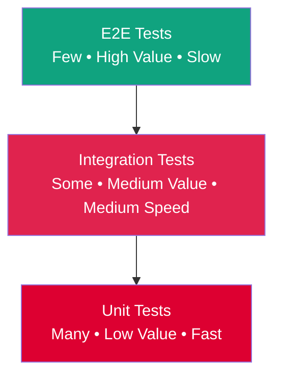

# Testing Strategy & Guidelines

MixologyHub follows a **Test-Driven Development (TDD)** approach, using the BDD scenarios in `docs/product/use-cases/` as the source of truth for both unit and integration tests.

## 🏗️ Testing Pyramid & TDD Workflow

### The Testing Pyramid
We follow the classic testing pyramid to ensure comprehensive coverage while maintaining development velocity:



**Pyramid Distribution:**
- **70% Unit Tests**: Fast, isolated tests of individual functions and services
- **20% Integration Tests**: Service-layer tests with mocked external dependencies  
- **10% E2E Tests**: Full system tests against real infrastructure

### Red-Green-Refactor Cycle
All features are developed using the TDD Red-Green-Refactor workflow:

1. **🔴 Red**: Write a failing test that defines the desired behavior
2. **🟢 Green**: Write the minimal code to make the test pass
3. **🔁 Refactor**: Improve the code while keeping tests green

### Behavior-Driven Development (BDD)
Tests are written from the user's perspective using Gherkin-style scenarios:

```gherkin
Feature: Inventory Management
  Scenario: User adds ingredient to inventory
    Given the user has no vodka in their inventory
    When they add "500 ml" of vodka
    Then their inventory should show "500 ml" of vodka
    And they should be able to make cocktails requiring vodka
```

These BDD scenarios from `use-cases/` drive both implementation and acceptance testing.

## 🧪 Running Tests

All test commands are available via the root `Makefile`:

```bash
# Run all test suites
make test

# Run backend tests only (Jest)
make test-backend

# Run frontend tests only (Vitest)
make test-frontend
```

### Backend Tests (Jest)

- **Unit Tests:** Test individual services and utilities in isolation. Repository dependencies are mocked.
- **E2E Tests:** Use `supertest` to hit actual HTTP endpoints against an in-memory or test database.

```bash
cd backend
npm run test        # Unit tests
npm run test:e2e    # End-to-end tests
npm run test:cov    # Coverage report
```

### Frontend Tests (Vitest)

- **Component Tests:** Verify template rendering and signal reactivity.
- **Service Tests:** Test HTTP wrappers and RxJS streams.
- **E2E Tests:** For full browser E2E testing, we use **Playwright** (configured as a separate test suite).

```bash
cd frontend
npm run test        # Run tests in watch mode
npm run test:ci     # Single run with coverage
npm run test:e2e    # Run Playwright E2E tests (requires backend running)
```

## 📊 Coverage Expectations

| Area                     | Target Coverage | Critical Paths |
|--------------------------|-----------------|----------------|
| `UnitConverterService`   | 100%            | Core business logic for inventory math, incompatible unit detection, base unit normalization, serving size scaling. |
| `MeasureParserService`   | 100%            | Fraction parsing, recurring decimal handling, qualitative measures. |
| `CocktailAggregatorService` | >80%         | Unified search and external API fallback, detailed external cocktail lookup, unified pagination, category filtering, Redis caching, dangling favorite handling. |
| `BarInventoryService`    | >80%            | ACID transactions (inside BullMQ Worker), queue serialization, zero quantity management, batch preparation. |
| `MakeableCocktailsService` | >80%         | Makeable detection, almost makeable logic, optional ingredients, serving size scaling. |
| `IngredientService`      | >90%            | Name normalization, deduplication, custom ingredient creation, case-insensitive matching. |
| AI Module                | >70%            | Prompt construction, JSON parsing, prompt injection defense, retry exhaustion handling, rate limiting, timeout handling, inventory-based generation. |
| `FavoritesService`       | >80%            | Idempotent operations, polymorphic data handling, removal operations, favorites hydration, dangling external favorite handling. |
| Frontend Components       | >60%            | Critical user flows (search, inventory, AI), error handling, empty states, route guards, RxJS debouncing, Signal reactivity. |
| Authentication Module    | 100%            | Password hashing, JWT signing, refresh token rotation, brute-force protection, registration/login flows, logout/session invalidation. |
| Pagination Logic         | >90%            | Page-based pagination, offset calculation, metadata generation across local and external data. |
| Redis Caching Layer      | >80%            | Cache hit/miss logic, TTL management, cache invalidation, external API response caching. |

## 🔧 Mocking Strategies

### Backend (Jest)
- Use `@nestjs/testing` to create a testing module with mocked providers.
- Mock TypeORM repositories using `jest-mock-extended` or manual mocks.
- For external HTTP calls (TheCocktailDB, LLMs), use `nock` or mock the service class.

### Frontend (Vitest)
- Use Angular's `TestBed` with `provideHttpClientTesting` to mock API calls.
- For signals, test computed values by directly setting source signals.

### Test Data Generation (Factories)
Because Cocktails require deep relational trees (Cocktail → Ingredients → Measures), manual mocking becomes brittle. We utilize the **Factory Pattern** (e.g., `faker.js` combined with a factory class) to generate valid test entities:

```typescript
// Example usage in tests
const mockCocktail = CocktailFactory.build({ id: '123', name: 'Mojito' })
  .withIngredients([
     IngredientFactory.build({ name: 'Rum' }),
     IngredientFactory.build({ name: 'Mint' })
  ]);
```

## 📝 Test Naming Convention

Follow the pattern: `it('should [expected behavior] when [condition]', () => { ... })`

**Example:**
```typescript
it('should convert 2 oz to approximately 59.15 ml', () => {
  const result = converter.convert(2, 'oz', 'ml');
  expect(result).toBeCloseTo(59.15, 2);
});
```

## 🚦 Continuous Integration

Tests are automatically executed on every push and pull request via GitHub Actions. A PR cannot be merged if any test fails or coverage drops below the defined thresholds.